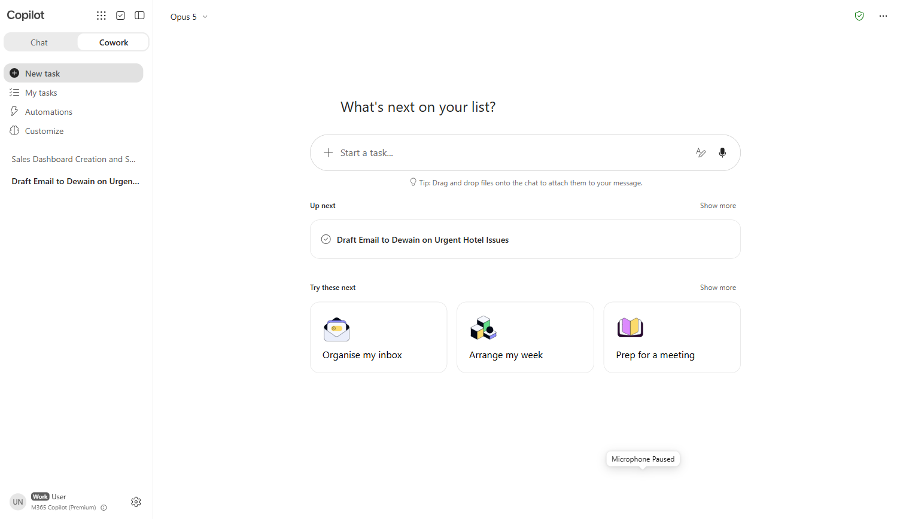
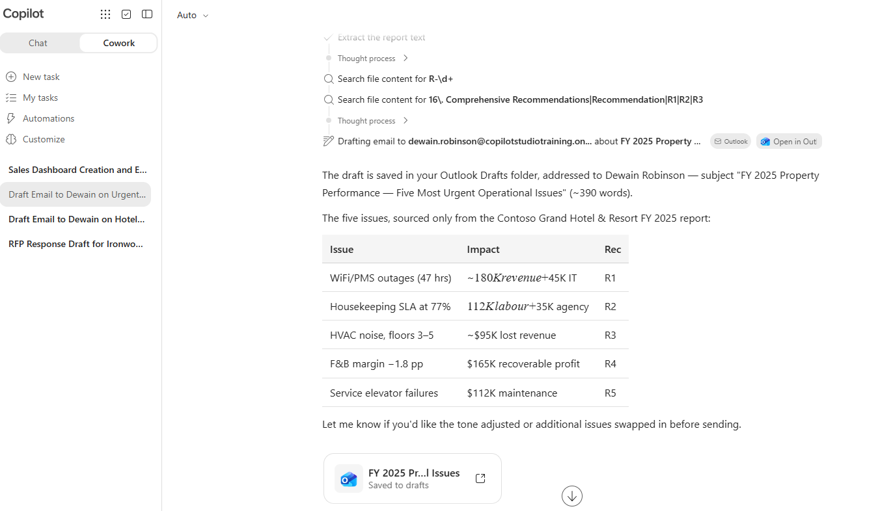
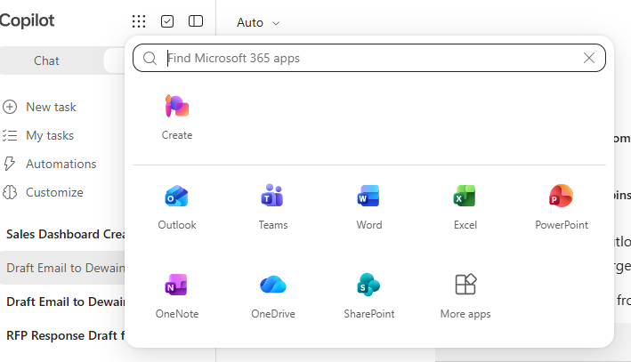
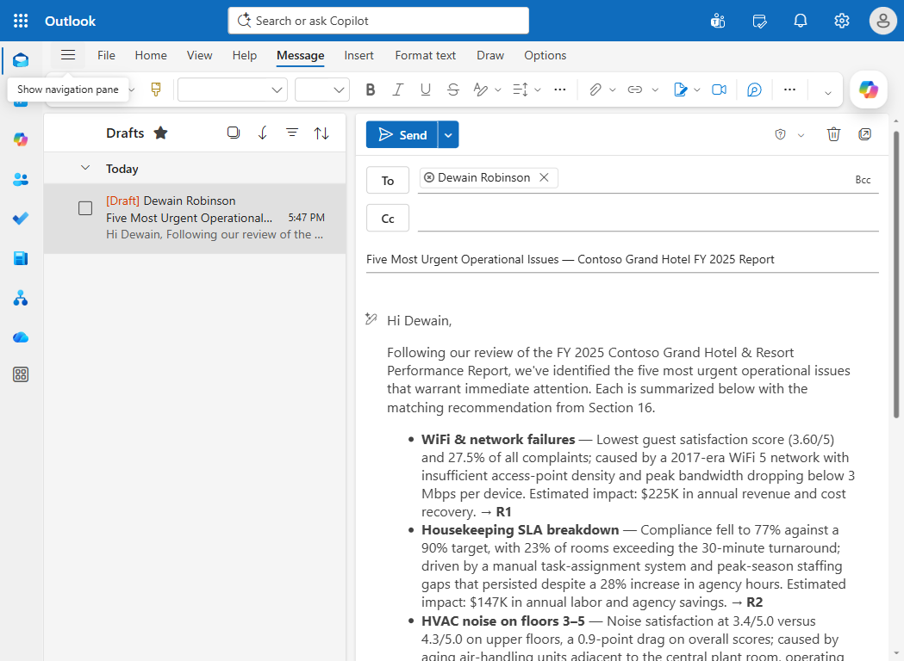
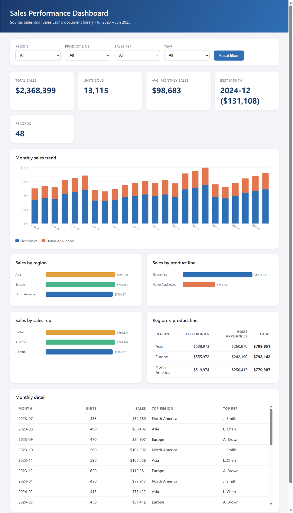
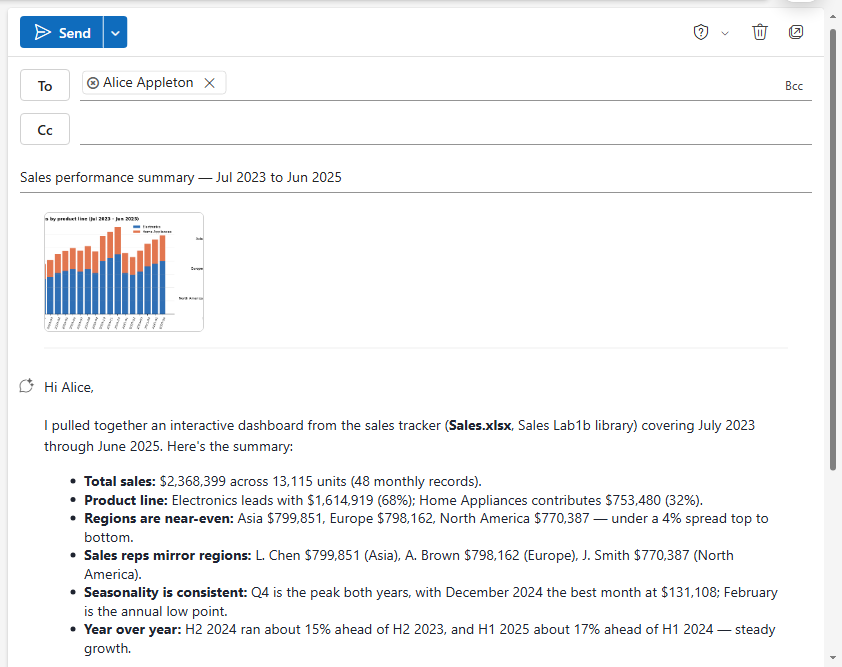
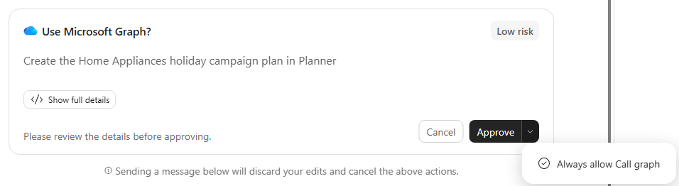
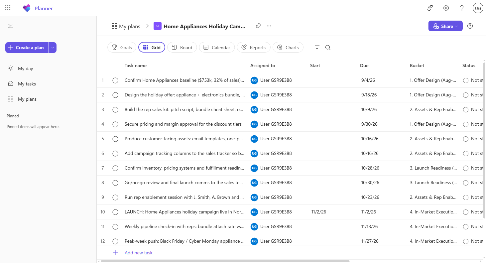
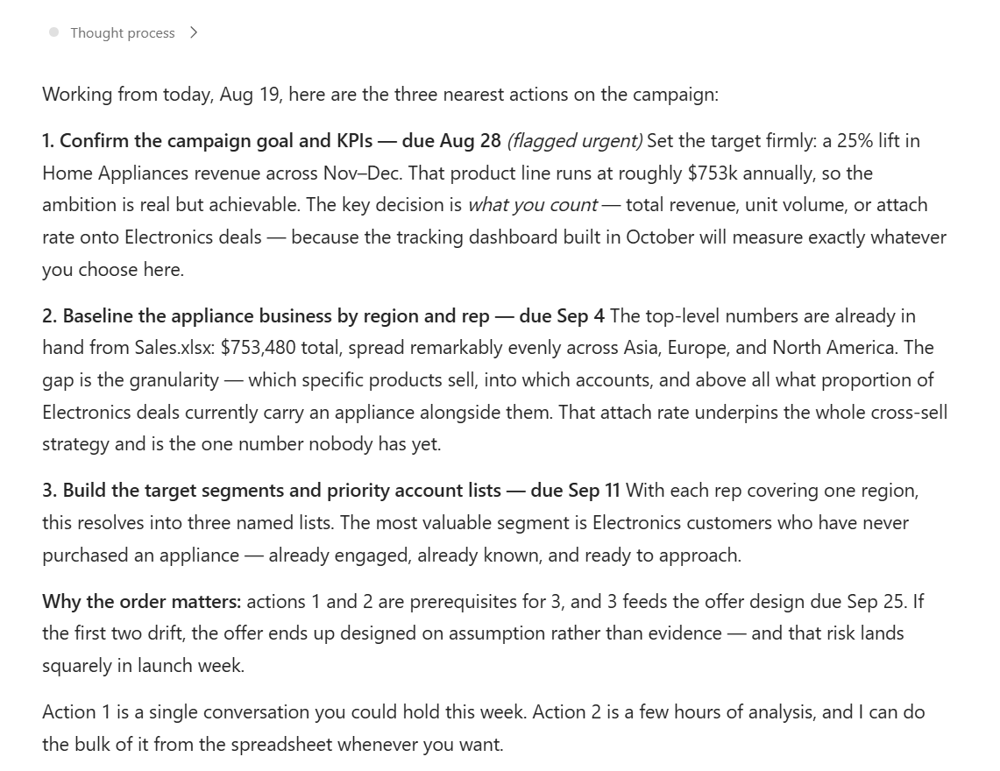

# Cowork 실습

[English](README.md) | **한국어**

실제 업무를 Copilot Cowork에 위임하세요. 문서를 전달하면 Cowork가 내용을 추론하고 사용자를 대신해 작업을 수행하므로, 그동안 사용자는 다른 일을 진행할 수 있습니다.

---

<a id="-lab-details"></a>
## 🧭 랩 세부 정보

| 수준 | 대상 | 소요 시간 | 목적 |
| ----- | ------- | -------- | ------- |
| 200 | 비즈니스 사용자 | 45분 | 이 랩을 완료하면 참가자는 문서에 근거한 작업을 Copilot Cowork에 위임하고, Cowork가 자신을 대신해 Microsoft 365에서 실제 결과물의 초안을 작성하게 하며, 이러한 위임 루프가 대화형 채팅과 어떻게 다른지 설명할 수 있습니다. |

---

<a id="-table-of-contents"></a>
## 📚 목차

- [중요한 이유](#-why-this-matters)
- [소개](#-introduction)
- [핵심 개념 개요](#-core-concepts-overview)
- [설명서 및 추가 교육 링크](#-documentation-and-additional-training-links)
- [필수 조건](#-prerequisites)
- [학습 목표 요약](#-summary-of-targets)
- [다루는 사용 사례](#-use-cases-covered)
- [사용 사례별 지침](#️-instructions-by-use-case)
  - [사용 사례 #1: PDF 보고서에서 Cowork 에이전트로 경영진 이메일 초안 작성](#-use-case-1-draft-an-executive-email-with-the-cowork-agent-from-a-pdf-report)
  - [사용 사례 #2: SharePoint에서 대화형 영업 대시보드 구축 및 요약 이메일 초안 작성](#-use-case-2-build-an-interactive-sales-dashboard-from-sharepoint-and-draft-the-summary-email)
  - [사용 사례 #3: Planner에서 영업 캠페인 구축 및 즉시 수행할 작업 식별](#-use-case-3-build-a-sales-campaign-in-planner-and-identify-immediate-actions)

---

<a id="-why-this-matters"></a>
## 🤔 중요한 이유

**Chat은 답변하고, Cowork는 일을 수행합니다.**

부트캠프의 지금까지 과정은 모두 대화형이었습니다. 사용자가 질문하면 도구가 응답하고, 사용자는 그 응답을 바탕으로 행동했습니다. Cowork는 이 패턴을 바꿉니다. 사용자가 결과를 위임하면 Cowork가 필요한 단계를 수행하고, 검토할 수 있는 완성된 결과물을 돌려줍니다.

이러한 전환이 핵심이지만, 대부분의 사용자가 처음 접할 때 놓치는 부분이기도 합니다. Cowork 작업의 평가 기준은 답변이 얼마나 잘 쓰였는지가 아니라, 요청한 일이 실제로 완료되었는지 여부입니다.

---

<a id="-introduction"></a>
## 🌐 소개

Copilot Cowork는 위임받은 작업을 에이전트 방식으로 수행합니다. 원본 자료를 읽고, 조직에서 필요한 사람과 정보를 찾아내며, 실제로 전송하기 전에 사용자가 검토할 수 있도록 이메일 초안, 문서, 업데이트 모음과 같은 실제 Microsoft 365 결과물을 만듭니다.

이 랩에서는 부트캠프의 다른 과정에서도 사용한 연례 호텔 성과 보고서를 Cowork에 전달하고, 지정한 동료에게 가장 긴급한 운영 문제를 브리핑하도록 요청한 다음, 실제 Outlook 초안이 생성되었는지 확인합니다.

---

<a id="-core-concepts-overview"></a>
## 🎓 핵심 개념 개요

| 개념 | 중요한 이유 |
| ------- | -------------- |
| **위임** | 프롬프트의 순서가 아니라 원하는 결과를 설명합니다. 단계는 Cowork가 결정합니다. |
| **에이전트 작업** | 사용자가 다른 곳에 복사해야 하는 텍스트가 아니라 Microsoft 365의 실제 결과물을 만듭니다. |
| **사용자 콘텐츠에 기반한 근거 설정** | 업로드한 문서와 조직 컨텍스트가 모두 작업에 활용됩니다. |
| **전송 전 검토** | 결과물은 초안으로 저장됩니다. 사람이 승인하도록 의도적으로 둔 관문입니다. |
| **병렬 실행** | 위임한 작업은 사용자가 다른 일을 하는 동안에도 계속됩니다. 답변을 기다릴 필요가 없습니다. |
| **공유 시스템에서 작업** | 모든 결과물에 초안 단계가 있는 것은 아닙니다. Planner 작업은 작성되는 즉시 동료의 보드에 반영됩니다. |

---

<a id="-documentation-and-additional-training-links"></a>
## 📄 설명서 및 추가 교육 링크

* [Microsoft 365 Copilot 설명서](https://learn.microsoft.com/microsoft-365-copilot/)
* [Microsoft 365 Copilot 개요](https://learn.microsoft.com/copilot/overview)

---

<a id="-prerequisites"></a>
## ✅ 필수 조건

- Microsoft 365 Copilot 라이선스가 있는 Microsoft 365 계정
- Copilot Cowork에 대한 액세스 권한
- 초안 이메일을 확인할 수 있도록 동일한 계정에서 사용 가능한 Outlook
- 샘플 보고서 PDF 다운로드: [Contoso Grand Hotel 성과 보고서](https://github.com/microsoft/mcs-labs/raw/main/labs/agent-builder-m365/Contoso_Grand_Hotel_Performance_Report.pdf)
- 사용 사례 #2: 계정이 접근할 수 있는 SharePoint 문서 라이브러리에 월, 지역, 제품군, 영업 담당자 열이 포함된 영업 추적 Excel 통합 문서가 있어야 합니다. 참조 테넌트에서는 `Sales Lab1b` 문서 라이브러리의 `Sales.xlsx`를 사용합니다. 또한 테넌트 디렉터리에서 검색되는 Dewain Robinson이라는 동료가 필요합니다.
- 사용 사례 #3: 동일한 계정에서 Planner를 사용할 수 있어야 하며, Cowork가 요청할 때 Microsoft Graph 동의를 부여할 수 있어야 합니다. 사용 사례 #3은 사용 사례 #2의 세션을 이어서 진행하므로 순서대로 실행하세요.

---

<a id="-summary-of-targets"></a>
## 🎯 학습 목표 요약

이 랩에서는 Cowork와 대화하는 대신 실제 작업을 위임합니다. 완료하면 다음을 수행할 수 있습니다.

- 복잡한 원본 문서를 Cowork에 업로드하고 해당 문서에 근거한 결과를 위임
- Cowork가 조직에서 수신자를 찾아 실제 Outlook 이메일 초안을 작성하도록 하기
- Cowork가 파일 위치를 알려 주지 않아도 Work IQ를 통해 SharePoint에서 파일을 찾도록 하기
- 스프레드시트 데이터를 측면 패널에서 탐색할 수 있는 대화형 HTML 대시보드로 변환
- Cowork가 만든 아티팩트의 그래픽을 Outlook 초안에 첨부하도록 하기
- 이전 Cowork 세션을 재개하고 이미 완료된 작업을 기반으로 후속 작업 수행
- Cowork가 실제 Planner 작업을 만들도록 하고, 이에 필요한 Microsoft Graph 동의 부여
- Cowork가 자체 계획의 우선순위를 정하고 즉시 수행할 작업 사이의 종속성을 설명하도록 요청
- Cowork가 만든 아티팩트를 확인하고 전송 전에 편집
- Copilot Chat 및 사용자 지정 에이전트와 비교하여 Cowork의 위치 설명

---

<a id="-use-cases-covered"></a>
## 🧩 다루는 사용 사례

| 단계 | 사용 사례 | 부가 가치 | 작업량 |
| ---- | -------- | ----------- | ------ |
| 1 | [PDF 보고서에서 Cowork 에이전트로 경영진 이메일 초안 작성](#-use-case-1-draft-an-executive-email-with-the-cowork-agent-from-a-pdf-report) | Cowork가 에이전트 작업을 수행합니다. PDF를 읽고 수신자를 찾은 다음 사용자를 대신해 실제 Outlook 이메일 초안을 작성합니다. | 10분 |
| 2 | [SharePoint에서 대화형 영업 대시보드 구축 및 요약 이메일 초안 작성](#-use-case-2-build-an-interactive-sales-dashboard-from-sharepoint-and-draft-the-summary-email) | Cowork가 Work IQ를 통해 통합 문서를 찾고, 데이터를 추출하고, 대화형 HTML 대시보드를 구축한 다음, 그래픽이 첨부된 이메일 초안을 작성합니다. | 20분 |
| 3 | [Planner에서 영업 캠페인 구축 및 즉시 수행할 작업 식별](#-use-case-3-build-a-sales-campaign-in-planner-and-identify-immediate-actions) | Cowork가 초안 단계 없이 Planner에 실제 작업을 작성한 다음, 계획의 컨텍스트를 사용해 가장 가까운 작업의 우선순위를 정하고 종속성을 설명합니다. | 15분 |

---

<a id="️-instructions-by-use-case"></a>
## 🛠️ 사용 사례별 지침

---

<a id="-use-case-1-draft-an-executive-email-with-the-cowork-agent-from-a-pdf-report"></a>
## 🤝 사용 사례 #1: PDF 보고서에서 Cowork 에이전트로 경영진 이메일 초안 작성

Researcher(랩 1의 Researcher 연습)가 아직 백그라운드에서 추론 중이어도 괜찮습니다. Cowork를 병렬로 실행할 수 있습니다. **Cowork**로 전환해 순수 대화형 에이전트가 할 수 없는 작업을 수행해 보세요. 복잡한 비즈니스 문서를 에이전트 방식으로 읽고, 조직에서 적절한 수신자를 찾고, 사용자가 검토하고 전송할 수 있도록 Outlook에 완성된 이메일 초안을 작성합니다.

| 사용 사례 | 부가 가치 | 예상 작업량 |
| ---------------------------------------------- | ----------------------------------------------------------------------------------------------------------------- | ---------------- |
| Cowork로 경영진 이메일 초안 작성 | Cowork가 에이전트 작업을 수행합니다. PDF를 읽고 수신자를 찾은 다음 사용자를 대신해 실제 Outlook 이메일 초안을 작성합니다. | 5분 |

**작업 요약**

이 섹션에서는 동일한 Contoso PDF를 Cowork 에이전트에 업로드하고, 가장 긴급한 운영 문제를 요약하여 특정 동료에게 보낼 이메일 초안을 작성하도록 요청한 다음, Outlook에 초안이 생성되었는지 확인합니다.

**시나리오:** 여러분은 Contoso Grand Hotel의 운영 책임자로, 연례 성과 보고서에서 가장 시급한 문제를 동료 Dewain에게 알려야 합니다. 직접 이메일을 작성하는 대신 Cowork가 보고서에서 핵심 사실을 추출하고, Dewain에게 주소가 지정된 이메일 초안을 작성하게 합니다. 사용자는 이를 검토하고 편집한 뒤 전송할 수 있습니다.

### 목표

Cowork 에이전트를 사용하여 Researcher에 업로드했던 [동일한 PDF 보고서](https://github.com/microsoft/mcs-labs/raw/main/labs/agent-builder-m365/Contoso_Grand_Hotel_Performance_Report.pdf)를 읽고, 근본 원인과 권장 사항이 포함된 운영 문제 다섯 가지를 식별한 다음, 지정된 수신자(Dewain Robinson)에게 보낼 실제 Outlook 이메일 초안을 작성하게 합니다.

---

### 단계별 지침

#### Cowork 에이전트 열기

1. 동일한 Microsoft 365 Copilot 페이지(`https://m365.cloud.microsoft/chat/?auth=2&home=1`)에서 Copilot 패널 상단의 **Chat / Cowork** 토글에서 **Cowork**를 선택합니다.

   

   입력하기 전에 잠시 화면 구성을 살펴보세요. 메시지 입력란에는 "ask me anything"이 아니라 **Start a task…**라고 표시됩니다. 이 문구가 이 랩 전체에서 다루는 차이를 보여 줍니다. 대화를 시작하는 것이 아니라 결과를 맡기는 것입니다. 왼쪽 레일의 **My tasks**에는 실행 중인 위임 작업이 표시되고, **Automations**는 반복 실행할 작업에 사용됩니다. 그 아래에는 이전 세션이 나열되며, 사용 사례 #3에서 이 목록으로 돌아옵니다.

   > [!TIP]
   > Cowork는 Microsoft 365 Copilot에서 일반 공급되며 *에이전트 작업 수행*을 위해 설계되었습니다. 문서를 읽고, 테넌트에서 사람을 찾고, 사용자를 대신해 실제 Outlook 초안, Word 문서, Teams 메시지를 만들 수 있습니다. Researcher가 심층 분석에, Analyst가 데이터와 계산에 뛰어나다면 Cowork는 여러 Microsoft 365 화면에 걸친 다단계 작업을 완료하는 데 뛰어납니다.

#### 보고서 업로드 및 이메일 초안 작성 요청

1. **Add attachments**(메시지 입력란 옆의 종이 클립 아이콘)를 클릭한 다음 **Upload images and files (PDF, Word, Excel, images)**를 선택합니다. 랩 1의 Researcher 연습을 위해 다운로드한 [`Contoso_Grand_Hotel_Performance_Report.pdf`](https://github.com/microsoft/mcs-labs/raw/main/labs/agent-builder-m365/Contoso_Grand_Hotel_Performance_Report.pdf) 파일을 선택합니다.

1. 업로드가 완료될 때까지 기다립니다. PDF가 메시지 입력란 위에 칩으로 표시됩니다.

   > [!TIP]
   > Cowork에 파일을 제공하는 방법은 업로드뿐만이 아닙니다. 프롬프트를 편집하는 동안 `#`을 눌러 OneDrive에서 바로 선택할 수도 있습니다. 사용 사례 #2에서는 세 번째 방법을 사용합니다. Cowork가 파일을 직접 찾으므로 위치를 전혀 지정하지 않습니다.

1. 다음 프롬프트를 메시지 입력란에 붙여 넣고 **Send**를 누릅니다.

    ```text
    Create a draft email in my Outlook mailbox addressed to Dewain Robinson summarizing the five most urgent operational issues from the attached hotel performance report. Use the Outlook draft tool — do not just write the email text in chat.

    For each issue, include in one short bullet: the symptom, the root cause, the estimated financial impact, and the matching recommendation (Section 16 R-number).

    Address the email "Hi Dewain," and sign it from "The Operations Team". Keep the total email under 400 words. Use the PDF as the only source.
    ```

    > [!TIP]
    > Cowork는 이를 **다단계 작업**으로 실행합니다. (1) 첨부된 PDF를 읽고, (2) Work IQ를 통해 "Dewain Robinson"을 찾고, (3) Outlook 사서함에 새 이메일 초안을 작성하고, (4) 완료되면 채팅으로 보고합니다. Researcher와 달리 Cowork는 명확한 프롬프트에 대해 확인 질문을 거의 하지 않고 바로 작업하며, 일반적으로 약 2~3분 내에 완료합니다.

1. Cowork 에이전트가 다음과 같이 작업하는 모습을 **관찰**합니다.

   - 실행 업데이트를 스트리밍합니다(예: "Reading PDF", "Searching for Dewain Robinson", "Drafting email in Outlook").
   - 수신자가 올바르게 확인되었음을 알립니다(예: "Drafted email to Dewain Robinson").
   - 생성한 이메일의 요약을 채팅 내에 보고하고 **"Open it in Outlook to review, edit, or send"**로 마칩니다.

   

#### Outlook에서 초안 확인

1. 페이지 **왼쪽 위**의 **앱 시작 관리자**(3×3 점으로 된 "waffle" 아이콘)를 열고 **Outlook**을 선택합니다. Outlook이 **새 브라우저 탭**에서 열립니다.

   

   > [!IMPORTANT]
   > Outlook을 처음 방문하면 "Your privacy matters" 프롬프트가 나타날 수 있습니다. **Continue**를 클릭하여 닫으세요. 그러면 Outlook UI를 사용할 수 있습니다.

1. Outlook 왼쪽 레일에서 **Drafts** 폴더를 클릭합니다. Cowork가 방금 만든 이메일이 목록 맨 위에 있습니다. 제목에는 Contoso Grand Hotel 성과 보고서와 긴급 운영 문제가 언급됩니다(Cowork가 대화체로 제목을 만들므로 정확한 문구는 달라질 수 있습니다). 클릭하여 엽니다.

   

1. 초안을 **검토**합니다.

   - **수신자:** Dewain Robinson(연락처 필로 확인됨. 필에 마우스를 올리거나 클릭하면 SMTP 주소를 볼 수 있음)
   - **제목:** Contoso Grand Hotel 보고서와 긴급 운영 문제를 언급함(Cowork가 생성하므로 정확한 문구는 달라짐)
   - **본문:** 증상 + 근본 원인 + 재무 영향 + 권장 사항 R 번호를 각각 다루는 글머리 기호 다섯 개
   - **맺음말:** "Best regards, The Operations Team"
   - 전체 분량: 약 300~400단어

1. 여기서 일반 Outlook 이메일과 마찬가지로 초안을 **편집, 전송 또는 삭제**할 수 있습니다. 이 랩에서는 초안으로 남겨 두거나 삭제하세요. 실제로 전송할 필요는 없습니다.

   > [!TIP]
   > Cowork는 자신이 만든 초안에 `Sent by Copilot Cowork` 바닥글을 추가합니다. 깔끔한 서명을 원하면 전송 전에 이 줄을 삭제할 수 있습니다.

> [!TIP]
> 이제 랩 1의 Researcher 연습으로 돌아가 Researcher가 완료되었는지 확인하세요. 완료되었다면 두 결과물을 나란히 비교해 보세요. Researcher는 심층 분석 결과를 제공하고, Cowork는 바로 전송할 수 있는 실행 가능한 이메일을 제공합니다. 각 도구는 서로 다른 작업에 적합합니다.

---

### 축하합니다! Cowork를 사용하여 PDF 보고서에서 경영진 이메일 초안을 작성했습니다!

---

### 이해도 확인

**핵심 요점:**

- **Cowork는 에이전트 작업을 수행합니다.** 단순히 요약하지 않습니다. 문서를 읽고, 조직에서 사람을 찾고, 사용자가 검토할 수 있는 실제 아티팩트(Outlook 초안, Word 문서, Teams 메시지)를 만듭니다.
- **확인 질문을 위한 왕복이 없습니다.** 프롬프트가 명확하고 지시적이면("Y에 관해 X에게 이메일 초안을 작성하고, Z로 시작하고 W로 서명") Cowork는 후속 질문 없이 진행합니다. 구체적으로 작성하면 더 빠르고 예측 가능한 결과를 얻을 수 있습니다.
- **앱 간 통합** 결과물은 채팅이 아니라 **Outlook**에 있습니다. Cowork는 M365 경험을 "채팅에서 답변"하는 방식에서 "적절한 앱에서 작업 완료" 방식으로 전환합니다.
- **병렬 작업은 효과적입니다.** Cowork는 Researcher와 함께 사용하기 좋은 도구입니다. Researcher가 백그라운드에서 추론하는 동안 Cowork는 훨씬 짧은 시간에 실제로 전달 가능한 아티팩트의 초안을 작성합니다.

**과제: 자신의 사용 사례에 적용해 보기**

- 매주 동일한 원본 데이터로 작성하는 이메일은 무엇인가요? Cowork가 첫 번째 초안을 만들 수 있을까요?
- Cowork에게 어떤 Microsoft 365 문서를 읽게 하시겠습니까? 프로젝트 상태 보고서, 회의록, 고객 피드백 요약 등이 있을 수 있습니다.
- Cowork는 이메일 외에도 Word 문서와 Teams 메시지 초안을 작성할 수 있습니다. 업무의 어떤 시나리오에서 이런 에이전트 방식의 초안 작성이 유용할까요?

---

---

<a id="-use-case-2-build-an-interactive-sales-dashboard-from-sharepoint-and-draft-the-summary-email"></a>
## 🤝 사용 사례 #2: SharePoint에서 대화형 영업 대시보드 구축 및 요약 이메일 초안 작성

사용 사례 #1에서는 사용자가 파일을 업로드하고 Cowork에 아티팩트 하나를 요청했습니다. 이번에는 둘 다 제공하지 않습니다. 파일 위치를 알려 주지 않으며, 하나의 지침으로 Cowork가 찾기, 추출, 구축, 초안 작성이라는 네 가지 화면을 넘나들어야 합니다.

| 사용 사례 | 부가 가치 | 예상 작업량 |
| ------------------------------------------------------- | -------------------------------------------------------------------------------------------------------------------------------------------------------------- | ---------------- |
| 영업 대시보드 구축 및 요약 이메일 초안 작성 | Cowork가 Work IQ를 통해 통합 문서를 찾고, 데이터를 추출하고, 대화형 HTML 대시보드를 구축한 다음 그래픽이 첨부된 이메일 초안을 작성합니다. | 10분 |

**작업 요약**

이 섹션에서는 네 가지 화면에 걸친 하나의 지침을 Cowork에 제공합니다. Work IQ를 사용하여 SharePoint에서 영업 추적 통합 문서를 찾고, 데이터를 추출하고, 대화형 HTML 대시보드를 구축한 다음, 해당 대시보드의 차트가 첨부된 Outlook 이메일을 지정한 동료에게 보냅니다.

**시나리오:** 여러분은 영업 운영 분석가입니다. 영업 추적기는 SharePoint 어딘가에 있으며, Dewain Robinson은 원본 통합 문서를 열어 해석하지 않고도 미리 볼 수 있는 영업 시각 자료와 이해하기 쉬운 요약을 필요로 합니다. 직접 차트를 만들고 Outlook에서 이메일을 조립하는 대신, 하나의 프롬프트로 전체 과정을 위임하고 Cowork가 처리하는 모습을 관찰합니다.

### 목표

Cowork가 위치를 알려 주지 않은 상태에서 SharePoint의 영업 추적 통합 문서를 찾고, 월, 지역, 제품군, 영업 담당자별 영업을 다루는 대화형 HTML 대시보드를 구축하며, 데이터 요약과 대시보드의 그래픽이 첨부된 Outlook 이메일을 Dewain Robinson에게 보내도록 합니다.

---

### 단계별 지침

#### Cowork 에이전트 열기

1. Microsoft 365 Copilot 페이지에서 Copilot 패널 상단의 **Chat / Cowork** 토글에서 **Cowork**를 선택합니다.

1. **New Task**를 선택하여 새 Cowork 세션을 시작합니다. 그러면 이 사용 사례가 사용 사례 #1의 대화를 이어 가지 않습니다.

1. 패널 상단의 모델 선택기(기본값은 **Auto**)를 열고 **Claude**, **Opus 5**를 차례로 선택합니다.

   > [!IMPORTANT]
   > Cowork가 대시보드 코드를 직접 작성하므로 선택하는 모델에 따라 결과가 달라집니다. **Opus 5**에서는 아래 설명과 같이 교차 필터링 차트와 세부 정보 테이블이 포함된 대시보드가 생성됩니다. **Auto**에서 동일한 프롬프트를 사용하면 테이블 없이 필터만 있는 대시보드가 생성되기도 합니다. 랩의 결과와 일치하도록 Opus 5를 선택하세요.

1. 다음 프롬프트를 메시지 입력란에 붙여 넣고 **Send**를 누릅니다.

    ```text
    Find the sales tracker excel document in the document library and create an interactive html dashboard highlighting the sales by month, region, product line, and sales rep. Draft an email to Dewain Robinson with a summary of the data and attach the sales graphic from the dashboard to the email
    ```

    > [!TIP]
    > 이 프롬프트에 *포함되지 않은* 내용을 살펴보세요. 파일 경로, 사이트 이름, 단계의 순서가 없습니다. 사용자는 결과와 수신자만 지정했습니다. 통합 문서 찾기, 차트 구성 결정, 이메일에 넣을 그래픽 선택 등 그 사이의 모든 과정은 Cowork가 알아서 처리합니다.

#### Cowork의 작업 방식 관찰

1. **실행 추적을 관찰합니다.** Cowork는 여러 단계로 작업하며, 각 단계를 잠시 살펴볼 가치가 있습니다.

   - 먼저 **Work IQ**와 **SharePoint**를 사용하여 영업 추적기를 찾습니다. 사용자는 파일 위치를 알려 주지 않았습니다.
   - 스프레드시트를 열고 데이터를 추출합니다.
   - 정적 이미지 대신 대화형 컨트롤을 추가하여 **HTML**로 대시보드 레이아웃을 구축합니다.
   - 대시보드를 이미 사용할 수 있는 상태에서 이메일 초안 작성으로 넘어갑니다.

1. **이메일 초안이 아직 생성 중일 때 출력 창에서 대시보드를 클릭합니다.**

   > [!TIP]
   > 이 순간이 위임과 채팅을 구분합니다. 에이전트가 다음 아티팩트를 계속 작업하는 동안 사용자는 완성된 아티팩트를 읽고 있습니다. 어떤 작업도 사용자의 주의 때문에 중단되지 않으며, 에이전트 역시 다른 작업 때문에 멈추지 않습니다.

1. 측면 패널에서 대시보드를 **관찰**합니다. 지역, 제품군, 영업 담당자, 회계 기간에 대한 드롭다운 필터, KPI 타일, 막대를 클릭하면 전체 보기를 교차 필터링하는 차트, 월별 세부 정보 테이블이 있습니다. 이는 그림이 아니라 실제로 작동하는 아티팩트입니다. 다음 단계로 넘어가기 전에 필터를 사용해 보고, 막대 하나를 클릭하여 다른 모든 차트와 타일이 그에 맞게 다시 그려지는지 확인하세요.

   

   > [!NOTE]
   > Cowork는 실행할 때마다 이 대시보드를 처음부터 설계하므로 정확한 레이아웃, 차트 유형, 타일 구성은 스크린샷과 다를 수 있습니다. 필터와 차트는 안정적으로 포함되지만, 레코드 타일이나 두 번째 요약 테이블 같은 추가 요소는 있을 수도 있고 없을 수도 있습니다.

   > [!TIP]
   > 대시보드 제목 아래 줄을 읽어 보세요. *"Source: Sales.xlsx · Sales Lab1b document library · Jul 2023 – Jun 2025."*와 같은 형식으로 자체 출처를 표시합니다. 이는 Cowork가 올바른 통합 문서를 찾아 전체 내용을 읽었는지 가장 빠르게 확인하는 방법이며, 확인을 위해 패널을 벗어날 필요도 없습니다.

#### Outlook에서 초안 확인

1. 왼쪽 위의 앱 시작 관리자(3×3 "waffle" 아이콘)를 열고 **Outlook**을 선택한 다음 **Drafts** 폴더를 클릭합니다.

1. Cowork가 만든 초안을 열고 다음을 확인합니다.

   - **수신자:** 연락처 필로 확인된 Dewain Robinson
   - **본문:** 차트만 있는 것이 아니라 영업 데이터에 대한 서면 요약이 있음
   - **그래픽:** 대시보드의 영업 시각 자료가 이메일에 첨부되어 있으며 미리 볼 수 있음

   

1. 초안으로 남겨 둡니다. 사용 사례 #1과 마찬가지로 전송할 필요는 없습니다.

   > [!TIP]
   > 이메일 요약에서 수치 하나를 골라 SharePoint의 원본 통합 문서와 비교하세요. 대시보드와 이메일은 모두 동일한 추출 결과에서 생성되었으므로, 스프레드시트와 일치하지 않는 수치가 있다면 이전 단계에서 문제가 발생했다는 뜻입니다. 동료에게 보내기 전에 바로 이런 확인을 해야 합니다.

---

### 축하합니다! 하나의 지침으로 Cowork가 찾기, 분석, 시각화, 초안 작성을 모두 수행하게 했습니다!

---

### 이해도 확인

**핵심 요점:**

- **하나의 프롬프트, 네 가지 화면** — 검색, 추출, 시각화, 초안 작성입니다. 사용자는 결과를 설명했고, Cowork는 각 단계의 확인을 요청하지 않고 순서를 결정하여 실행했습니다.
- **Work IQ가 파일을 찾았습니다.** 사용자는 경로나 사이트 이름을 제공하지 않았습니다. 파일 찾기는 사용자가 작성한 프롬프트의 일부가 아니라 위임한 문제의 일부였습니다.
- **대시보드는 그림이 아니라 라이브 아티팩트입니다.** 대화형 컨트롤이 있으며 측면 패널에서 열립니다. Cowork는 실제로 작동하는 결과물을 만든 다음 그 결과물의 정지 이미지를 이메일에 첨부했습니다.
- **사용자가 탐색하는 동안에도 작업은 계속됩니다.** 실행 중간에 대시보드를 열어도 이메일 초안 작성은 중지되지 않습니다. 이러한 병렬 처리가 바로 위임 모델이 약속한 방식입니다.
- **검토 관문이 다시 유지되었습니다.** 이메일은 초안입니다. Cowork는 작업을 준비한 뒤 멈췄습니다.

**과제: 자신의 사용 사례에 적용해 보기**

- 현재 일정에 따라 직접 차트를 만들고 이메일로 보내는 스프레드시트는 무엇인가요?
- 추적기가 매주 업데이트된다면 매번 수동으로 다시 실행하시겠습니까, 아니면 직접 만드는 예약 에이전트에 적합한 작업일까요?
- 보고 업무의 어떤 부분에서 대화형 대시보드가 모두가 현재 이메일에 붙여 넣는 정적 차트보다 더 유용할까요?

---

---

<a id="-use-case-3-build-a-sales-campaign-in-planner-and-identify-immediate-actions"></a>
## 🤝 사용 사례 #3: Planner에서 영업 캠페인 구축 및 즉시 수행할 작업 식별

사용 사례 #1과 #2는 모두 사용자가 결정할 때까지 자신의 사서함에 비공개로 되돌릴 수 있게 저장되는 초안 단계에서 멈췄습니다. 이번에는 다릅니다. Cowork는 Planner에 실제 작업을 작성하며, 작성하는 순간 해당 계획에 작업이 존재하게 됩니다.

| 사용 사례 | 부가 가치 | 예상 작업량 |
| -------------------------------------------------- | -------------------------------------------------------------------------------------------------------------------------------------------------------------------- | ---------------- |
| Planner에서 영업 캠페인 구축 및 우선순위 지정 | Cowork가 초안 단계 없이 Planner에 실제 작업을 작성한 다음, 가장 가까운 작업을 식별하고 작업 사이의 종속성을 설명합니다. | 10분 |

**작업 요약**

이 섹션에서는 사용 사례 #2 세션을 재개하고, Cowork가 영업 데이터에서 발견한 내용을 Planner의 캠페인 계획으로 전환하도록 요청합니다. Planner에 쓰는 데 필요한 Microsoft Graph 동의를 승인하고, 생성된 작업을 검토한 다음, 가장 가까운 작업 세 가지를 식별하도록 요청합니다.

**시나리오:** 사용 사례 #2에서 만든 대시보드는 가전제품 실적이 부진함을 보여 주었으며, 영업 담당자에게는 3개월 후 시작할 수 있는 캠페인이 필요합니다. 계획을 직접 작성하고 작업을 하나씩 입력하는 대신 두 작업을 모두 위임한 다음, Cowork에 가장 먼저 주의를 기울여야 할 작업의 우선순위를 정하도록 요청합니다.

### 목표

이전 Cowork 세션을 재개하고, Cowork가 영업 담당자가 활용할 수 있는 작업이 포함된 Home Appliance 캠페인을 Planner의 계획으로 만들도록 합니다. Planner에 쓰는 데 필요한 Microsoft Graph 동의를 부여한 다음, Cowork에 가장 가까운 작업 세 가지와 그 종속성을 식별하도록 요청합니다.

---

### 단계별 지침

#### 이전 세션 재개

1. Microsoft 365 Copilot 페이지에서 **Cowork**를 엽니다.

1. 사용 사례 #2에서 사용한 **previous session**을 엽니다.

   > [!TIP]
   > 이 단계는 보기보다 중요합니다. 해당 세션에는 Cowork가 추출한 영업 데이터, 구축한 대시보드, 도출한 결론이 이미 있습니다. 세션을 재개하면 파일을 다시 첨부하거나 내용을 다시 설명하지 않고도 다음 프롬프트에서 "the weak home appliances business"를 언급할 수 있습니다. 새 세션은 아무 컨텍스트 없이 시작됩니다.

#### 캠페인 계획 위임

1. 다음 프롬프트를 입력하고 **Send**를 누릅니다.

    ```text
    I want to build a sales campaign to shore up the weak home appliances business. Create a short sales campaign with my name in Planner that our sales reps can use to boost sales around home appliances. Let's design a plan to launch the campaign three months from now.
    ```

    > [!TIP]
    > "With my name in Planner"는 공유 테넌트에서 실질적인 역할을 합니다. 교육장에 있는 다른 모든 사람의 계획과 자신의 계획을 구분할 수 있게 해 줍니다. 시작 날짜만 엄격한 제약 조건으로 지정하며, 캠페인 구조, 작업, 순서는 모두 Cowork가 결정합니다.

1. Cowork에 **Use Microsoft Graph?**가 표시되면 **Approve** 옆의 화살표를 열고 **Always allow Call graph**를 선택합니다.

   

   > [!IMPORTANT]
   > 이 화면은 권한 경계를 명확하게 보여 줍니다. 파일을 읽고 메일 초안을 작성할 때는 추가 동의가 필요하지 않았지만, Planner에 쓰려면 동의가 필요합니다. **Always allow**는 이후 호출에도 계속 적용되므로, 이번 한 번뿐 아니라 뒤따르는 모든 작업에 관한 결정입니다.

   > [!TIP]
   > **Always allow Call graph**는 **Approve** 이후 단계가 아니라 **Approve** 버튼 *자체의* 드롭다운에 있습니다. 일반 **Approve**는 단일 호출 한 번만 승인하고 카드가 사라집니다. 이 계획을 만들려면 Cowork가 수십 번의 Graph 호출을 해야 하므로 하나씩 승인하면 매번 프롬프트가 나타납니다.

#### Planner에서 작업 검토

1. 왼쪽 위의 앱 시작 관리자(3×3 "waffle" 아이콘)를 열고 **More apps**를 선택한 다음 **Planner**를 선택합니다. Planner가 새 창에서 열립니다.

1. **My plans**를 선택한 다음 Cowork가 만든 계획을 엽니다. 계획 이름에는 캠페인과 사용자 이름이 함께 들어 있습니다. Cowork가 작성한 작업을 **관찰**합니다. 시작일을 기준으로 역산한 단계별 버킷과 기한이 표시됩니다. 전체 계획을 한눈에 보려면 **Grid** 보기로 전환합니다.

   

   > [!NOTE]
   > **My Tasks**가 아니라 **My plans**를 사용하세요. My Tasks에는 사용자에게 할당되고 *인덱싱까지 완료된* 작업만 표시되며, 계획에 작업이 이미 있어도 랩의 이 시점에는 비어 있는 경우가 많습니다. My Tasks가 비어 있어도 문제가 발생한 것이 아니므로 계획을 직접 여세요.

#### 즉시 수행할 작업 요청

1. Cowork로 돌아가 세션을 클릭하여 재개합니다.

1. 다음 프롬프트를 입력하고 **Send**를 누릅니다.

    ```text
    What are the 3 immediate actions to be taken care of?
    ```

    > [!TIP]
    > 이 프롬프트에 포함되지 않은 내용을 살펴보세요. 어떤 계획인지, 어떤 작업인지, 어디에서 찾을지 적혀 있지 않습니다. Cowork가 이 세션에서 계획을 만들었으므로 여전히 알고 있습니다. 이것이 컨텍스트를 유지하는 에이전트와 매번 다시 설명해야 하는 도구의 차이입니다.

#### Cowork의 우선순위 지정 검토

1. Cowork가 가장 가까운 캠페인 작업 세 가지를 반환하고 작업 사이의 종속성을 설명하는 모습을 **관찰**합니다.

   

   > [!NOTE]
   > Cowork는 오늘 날짜와 자신이 만든 계획을 바탕으로 답변하므로, 작업 이름, 날짜, 종속성은 예시와 다를 수 있습니다.

---

### 축하합니다! Cowork가 실제 업무를 계획하고 가장 먼저 주의를 기울일 작업의 우선순위를 정하게 했습니다!

---

### 이해도 확인

**핵심 요점:**

- **세션은 컨텍스트를 유지합니다.** 사용 사례 #2의 대화를 재개했으므로 "the weak home appliances business"라는 한 문장만으로 충분했습니다. Cowork에는 데이터, 대시보드, 자체 분석이 여전히 남아 있었습니다.
- **일부 작업에는 초안 단계가 없습니다.** 이메일은 사용자를 기다리지만 Planner 작업은 그렇지 않습니다. 에이전트가 쓸 수 있는 시스템이 많아질수록 이러한 구분은 더욱 중요해집니다.
- **동의에서 경계가 드러납니다.** 읽기와 초안 작성은 별도 승인 없이 가능했지만 Planner에 쓰려면 명시적인 Microsoft Graph 승인이 필요했습니다. "Always allow"는 이번 한 번뿐 아니라 향후 모든 호출에 대한 결정입니다.
- **우선순위 지정은 세션 컨텍스트를 사용합니다.** 짧은 질문 하나만으로 Cowork는 사용자가 계획을 다시 설명하지 않아도 가장 가까운 작업을 식별하고, 순서가 중요한 이유를 설명하며, 종속성을 알려 주었습니다.

**과제: 자신의 사용 사례에 적용해 보기**

- 다른 사람이 이미 작성한 보고서를 바탕으로 수동으로 만드는 프로젝트 계획은 무엇인가요?
- 에이전트가 시스템에 작업을 쓰기 전에 승인 관문이 필요한 업무는 어디이며, 그 관문이 방해만 되는 업무는 어디인가요?
- 에이전트가 계획을 만들 때 어떤 작업이 가장 긴급한지 결정하기 위해 어떤 컨텍스트를 사용해야 할까요?

---

---

<a id="-summary-of-learnings"></a>
## 🏆 학습 내용 요약

**여러분은 대화한 것이 아니라 위임했습니다.** 세 가지 지침으로 Outlook 초안, 대화형 대시보드, 프로젝트 계획을 만들었으며, 창 사이에서 콘텐츠를 복사할 필요가 없었습니다.

**Cowork는 Microsoft 365 안에서 작업했습니다.** 결과물은 사용자가 다른 곳에 배치해야 하는 제안 텍스트 블록이 아니라, 사서함의 실제 초안, 탐색할 수 있는 실제 대시보드, 실제 보드의 실제 작업이었습니다.

**Cowork는 입력 자료를 스스로 찾았습니다.** 사용 사례 #2에서 통합 문서의 위치를 알려 주지 않았습니다. 파일 찾기는 사용자가 지정한 내용이 아니라 위임한 작업의 일부였습니다.

**작업 사이에서 컨텍스트가 유지되었습니다.** 사용 사례 #3은 사용 사례 #2에서 발견한 내용을 바탕으로 캠페인을 만들고, 짧은 질문 하나로 자체 계획의 우선순위를 정했습니다. 다시 설명하거나 처음부터 시작할 필요가 없었습니다.

**검토 관문이 있는 곳에서는 관문이 유지되었습니다.** 이메일은 사용자를 기다렸지만 Planner 작업은 그렇지 않았습니다. Cowork가 결정하는 순간 작업이 반영되었으며, 그 과정에서 Microsoft Graph 동의가 유일한 확인 지점이었습니다.

---

<a id="-conclusions--recommendations"></a>
## 📌 결론 및 권장 사항

**질문이 아니라 작업이라면 Cowork를 사용하세요.** 원하는 결과가 이메일, 대시보드, 작업 모음 같은 아티팩트라면 대화보다 위임이 더 효과적입니다.

**어떤 작업에 초안 단계가 있고 어떤 작업에는 없는지 파악하세요.** 초안 단계가 있다면 그것은 사용자의 통제 수단이므로 활용해야 합니다. 초안 단계가 없는 Planner나 다른 사람과 공유하는 시스템에 곧바로 쓰는 모든 작업에서는 동의 프롬프트가 유일한 확인 지점이며, "always allow"를 선택하면 이후 모든 실행을 대신해 이 확인을 한 번에 사용하게 됩니다. 이에 맞게 위임 범위를 정하세요.

**대안과 비교해 적절히 배치하세요.** Chat은 답변하고, Cowork는 행동하며, 사용자 지정 에이전트는 사용자가 소유하는 반복 가능한 프로세스를 구현합니다. 세 가지는 나란히 존재하며, 올바르게 선택하는 것이 이 부트캠프에서 가르치는 설계 역량입니다.
